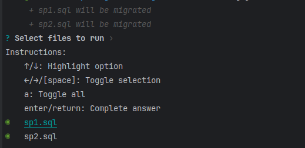

# HashMig

> HashMig MySQL migrations based on file hash.
> 
> See https://medium.com/p/0a970b72ba3e

CLI migrations tool for MySQL stored procedures and functions.
Just add or change `*.sql` file in the folder `hashmig_migrations` (or from the `folder` parameter of the configuration file) and run `hashmig run` command.
HashMig will execute new migrations and save them in table `hashmig_migrations` (or from `table` parameter of the configuration file).
It allows easy work with stored procedures and functions in MySQL. Any developer from your team can change the file; if another developer changes the same, it can be easily merged as usual git merge.
Also, it allows you to find who and when changed corresponding stored procedure

Typical `*.sql` file for stored procedure:

```sql
DROP PROCEDURE IF EXISTS `some_procedure`;
-- NEW_COMMAND
CREATE  PROCEDURE `some_procedure`()
BEGIN
    SELECT 1;
END;
```

_As you can see, you can use `-- NEW_COMMAND` comment to separate commands in one file_

The result of the command `hashmig run`:



## Table of Contents

- [Install](#install)
- [Usage](#usage)
- [License](#license)

## Install

This project uses [node](http://nodejs.org) and [npm](https://npmjs.com). Go check them out if you don't have them locally installed.

```bash
$ npm install --save @rsol/hashmig
```

## Usage

```bash
hashmig
```

Result:

```bash
Usage: hashmig [options] [command]

CLI migrations tool for MySQL stored procedures and functions

Options:
  -V, --version          output the version number
  -c, --config <string>  Path to config file (default: "./hashmig.config.json")
  -h, --help             display help for command

Commands:
  run [options]          Execute migrations
  clear                  Clear folder and table
  init                   Fill table and folder by existing stored procedures and functions
  help [command]         display help for command


To configure, you can use `./hashmig.config.json` (see `./hashmig.example.config.json`) file or the following environment variables:
  DB_PORT - post number
  DB_SERVER - server address
  DB_SELECT - database name
  DB_USERNAME - username
  DB_PASSWORD - password
  HASHMIG_FOLDER - path to folder with migrations
  HASHMIG_TABLE - name of table with migrations
  HASHMIG_SILENT - disable logger
```

Command `run`:

```bash
hashmig help run
```

Result:

```bash
Usage: hashmig run [options]

Execute migrations

Options:
-n, --noninteractive  Non-interactive mode (default: false)
-h, --help            display help for command
```

Example of configuration file `./hashmig.config.json`:

```json
{
  "db": {
    "port": 3306,
    "host": "localhost",
    "database": "example",
    "user": "root",
    "password": "root",
    "ssl": { "rejectUnauthorized": false }
  },
  "folder": "./hashmig_example_migrations",
  "table": "hashmig_example_migrations",
  "silent": false
}
```

### Command for CI/CD:

```bash
hashmig --config=hashmig.user.config.json run -n
```

## License

[MIT License](https://opensource.org/licenses/MIT) © Slava Rudnev
